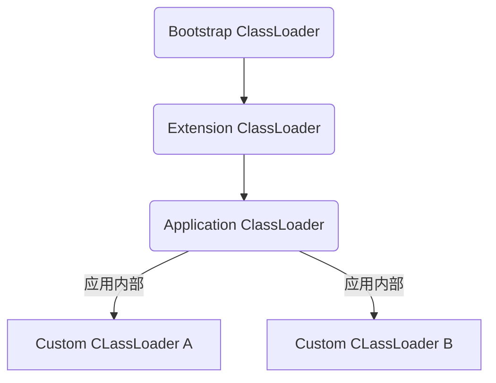

##### arthas classLoader 解释

前提说明：

1. agentJar 都是附着在Application ClassLoader
2. premain-class 和 agent_Class的平级class文件 application ClassLoader可见



通过这两特性，一般复杂的agent程序，都有必要在内部实现一个自己的classLoader


arthas classLoader 解释说明

```sequence

arthasBoot->CMD: 参数A
CMD->arthasCore: 参数B
arthasCore->arthasAgent: 参数C
arthasAgent->arthasDemo: agent Load


```

1. 参数A [E:\software_use\jdk\jdk1.8.0_144\jdk1.8.0_144\jre\..\bin\java.exe, -Xbootclasspath/a:E:\software_use\jdk\jdk1.8.0_144\jdk1.8.0_144\jre\..\lib\tools.jar, -jar, C:\Users\zhangyi_m\.arthas\lib\3.1.7\arthas\arthas-core.jar, -pid, 13228, -target-ip, 127.0.0.1, -telnet-port, 3658, -http-port, 8563, -core, C:\Users\zhangyi_m\.arthas\lib\3.1.7\arthas\arthas-core.jar, -agent, C:\Users\zhangyi_m\.arthas\lib\3.1.7\arthas\arthas-agent.jar]
2. 参数B [C:\Users\zhangyi_m\.arthas\lib\3.1.7\arthas\arthas-core.jar, -pid, 13228, -target-ip, 127.0.0.1, -telnet-port, 3658, -http-port, 8563, -core, C:\Users\zhangyi_m\.arthas\lib\3.1.7\arthas\arthas-core.jar, -agent, C:\Users\zhangyi_m\.arthas\lib\3.1.7\arthas\arthas-agent.jar]
3. 参数C [**E%3A%5Cidea2019DevWork%5Carthas%5Ccore%5Ctarget%5Carthas-core.jar;**;telnetPort=3658;httpPort=8563;ip=127.0.0.1;arthasAgent=E%3A%5Cidea2019DevWork%5Carthas%5Cagent%5Ctarget%5Carthas-agent.jar;sessionTimeout=1800;arthasCore=E%3A%5Cidea2019DevWork%5Carthas%5Ccore%5Ctarget%5Carthas-core.jar;javaPid=9424;]

Arthas.attachAgent(Configure configure)     102行

```java
String arthasAgentPath = configure.getArthasAgent();
//convert jar path to unicode string
configure.setArthasAgent(encodeArg(arthasAgentPath));
configure.setArthasCore(encodeArg(configure.getArthasCore()));
virtualMachine.loadAgent(arthasAgentPath,
        configure.getArthasCore() + ";" + configure.toString());
```

注意这里编码过来，还有参数三是arthas-core，后面arthas-agent 会把arthas-code 放入自己的arthasClassLoader，同时将 arthas-spy.jar 放入BootstrapClassLoader

疑惑：

​	我是通过源码debug，已经改过源码arthas-spy.jar 的路径，但是arthor-agent报错，arthas-spy.jar 不存在，最后必须把 arthas-spy.jar 放在 target/arthas-core.jar 同目录下（我是强制指定arthas-spy.jar，目录，没有让程序找arthas-core 同级目录，）

debug：

​	如果下伙伴需要 agent debug

1. 直接通过idea 开启 debug arthas-demo
2. 将参数B直接放入arthas-code【注意pid参数，还有相关文件路径，需要改换为自己的 cmd=>jps】
3. arthas-core-shade.jar =>arthas-core.jar(maven 配置文件没有写入导致)
4. arthas-agent-jar-with-dependencies.jar=>arthas-agent.jar （maven 配置文件没有写入导致）


参考：

1. [ClassLoader](https://www.jianshu.com/p/9388e359c912)
2. [Arthas源码分析](https://zhuanlan.zhihu.com/p/53984185)

剩下的那就debug，拾掇拾掇打碎的心